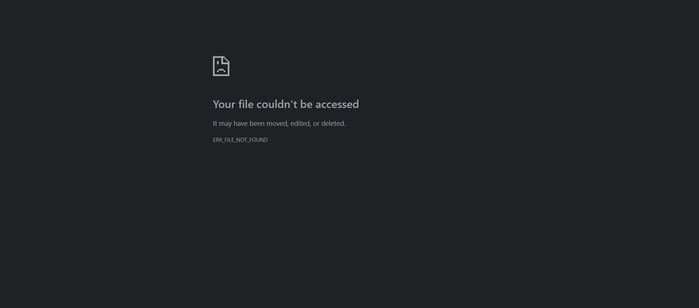
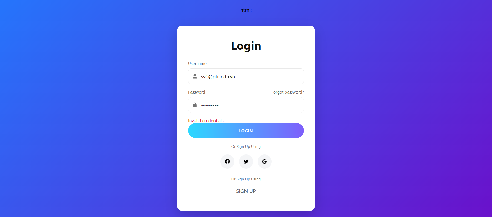
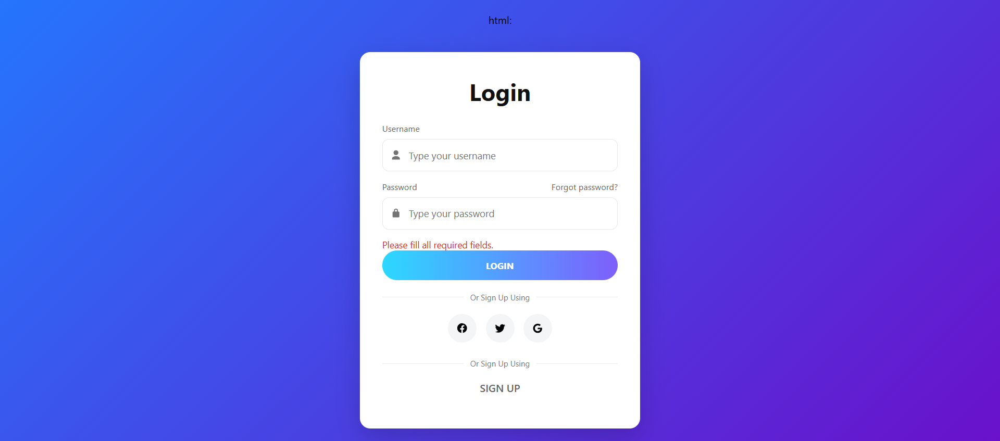
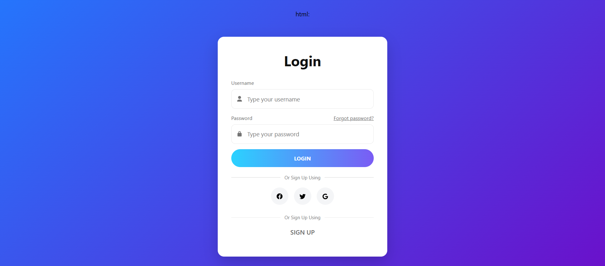
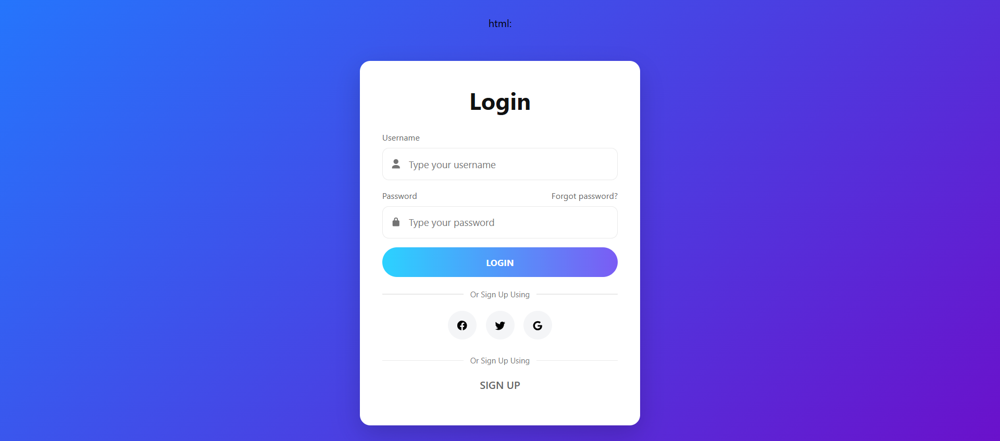
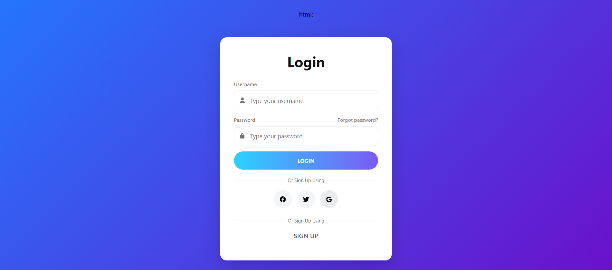

* Giới thiệu dự án
* Môi trường chạy
* Hướng dẫn chạy test
* Kết quả 6 test case (với hình minh họa tự động từ folder `screenshots/`)

---

##
# 🧪 Selenium Login Form Testing - N23DCPT017

## 👩‍💻 Giới thiệu
Dự án kiểm thử tự động form đăng nhập bằng **Selenium WebDriver** (Java + Maven + JUnit).  
Mục tiêu: kiểm tra tính chính xác, liên kết và trải nghiệm của trang **Login Form** thông qua 6 test case tự động.

---

## ⚙️ Môi trường chạy
- **Ngôn ngữ:** Java 17+ (đang dùng JDK 25)
- **Thư viện:** Selenium WebDriver 4.15.0, JUnit 4.13.2
- **Trình duyệt kiểm thử:** Google Chrome (phiên bản 141+)
- **IDE:** IntelliJ IDEA / VSCode / CMD Maven

---

## 🚀 Cách chạy test

### Cách 1: Bằng Maven (khuyên dùng)
```bash
mvn -Dtest=LoginFormTest test
````

### Cách 2: Trong IntelliJ IDEA

* Mở file `LoginFormTest.java`
* Nhấn **Run → Run 'LoginFormTest'**

> 💡 Nếu gặp lỗi “Class not found: LoginTest”, hãy chắc chắn:
>
> * Tên class trong code là `LoginFormTest`
> * File Java tên `LoginFormTest.java`
> * Đang chạy đúng thư mục `src/test/java/`

---

## ✅ Kết quả kiểm thử

| STT | Tên Test Case              | Mục tiêu                                                | Ảnh minh chứng                              |
| --- | -------------------------- | ------------------------------------------------------- | ------------------------------------------- |
| 1   | `testLoginSuccess()`       | Đăng nhập thành công với tài khoản hợp lệ               |        |
| 2   | `testInvalidLogin()`       | Kiểm tra nhập sai username/password                     |        |
| 3   | `testEmptyFields()`        | Bỏ trống trường nhập liệu                               |         |
| 4   | `testForgotPasswordLink()` | Kiểm tra liên kết “Forgot Password?”                    |  |
| 5   | `testSignUpLink()`         | Kiểm tra nút “SIGN UP” hoạt động                        |          |
| 6   | `testSocialButtons()`      | Kiểm tra 3 nút Social Login (Facebook, Google, Twitter) |       |

---

## 🧾 Kết quả tổng quan (JUnit)

```
Tests run: 6, Failures: 0, Errors: 0, Skipped: 0
BUILD SUCCESS
```

> 🟢 Tất cả 6 test case pass thành công.
> Ảnh minh họa lưu tự động trong thư mục `/screenshots`.

---

## 🧠 Ghi chú kỹ thuật

* Mỗi test case đều có `@After` để tự động **chụp ảnh màn hình trình duyệt**.
* Ảnh lưu tên theo **tên hàm test** → dễ đối chiếu kết quả.
* Có thể mở từng ảnh bằng **File Explorer** hoặc **Markdown preview** trong GitHub.

---

**Họ tên:** Vương Thị Hương Giang
**MSSV:** N23DCPT017
**Lớp:** D23CQPT01-N```
